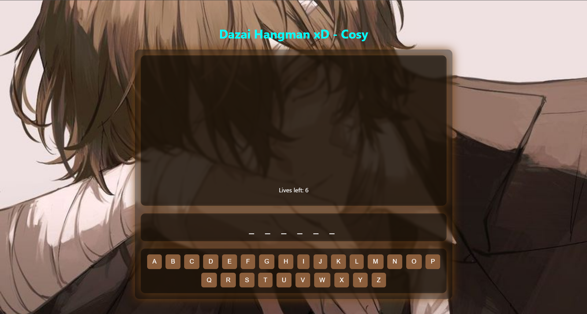
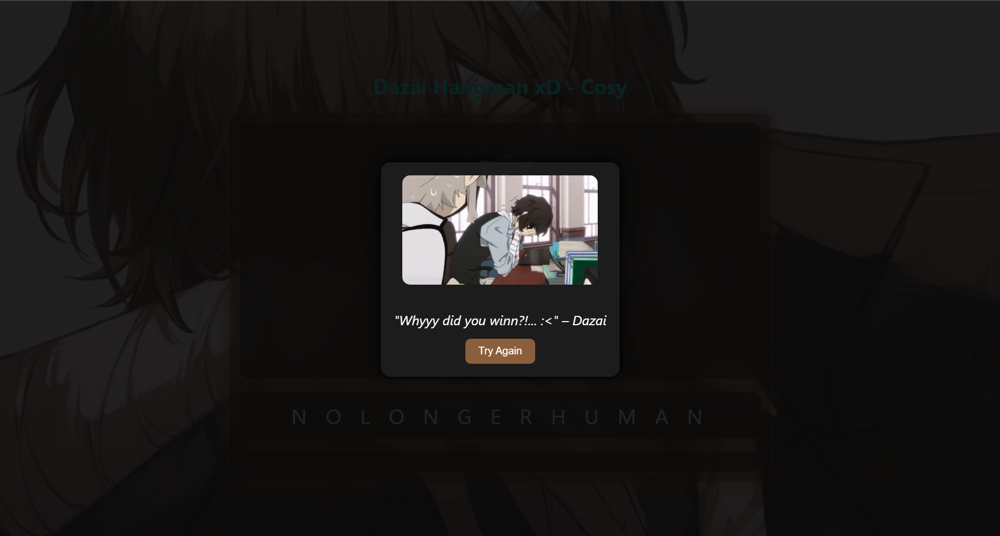

# 🕵️‍♂️ Dazai Hangman 

A Dazai-Themed Hangman Game~ A humored twist on the classic Hangman game!!! 

Themed around *Osamu Dazai* from Bungou Stray Dogs~ 


Guess the word before Dazai’s existential crisis reaches its limit... or he’ll take you with him on a double jisatsu xD

---

## 🎮 Play Now

👉 [Try it live on GitHub Pages](https://cosmoxthelegend.github.io/DazaiHangman)

---

## 📁 Assets Folder Structure

```

/assets
├── dazaibg.jpg           # Background image
├── dazaiwin.gif          # Shown when you win
├── dazailose.gif         # Shown when you lose
├── 0.png                 # Empty stage
├── 1.png to 6.png        # Hangman stages

```

---

## 🚀 How to Run Locally

1. **Clone the repository**
   ```bash
   git clone https://github.com/CosMoxTheLegend/DazaiHangman.git
   cd DazaiHangman

2. **Open `index.html` in your browser**

That's it! No setup or dependencies required.

---

## 🛠️ Built With

* **HTML**
* **CSS*
* **JavaScript**

---

## 📸 Preview





---

## ✨ Credits

Made with ~~love~~ suffering by [Cos Mox](https://github.com/CosMoxTheLegend)
Inspired by *Osamu Dazai* (Bungou Stray Dogs)
Assets edited and compiled manually

---

## ⚠️ Disclaimer

This is a **humor-based fan project**. It touches on dark themes through the lens of a fictional character. Viewer discretion is advised.

